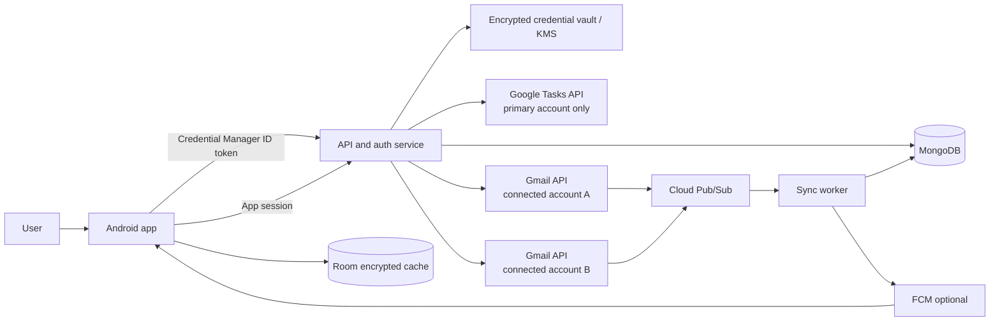
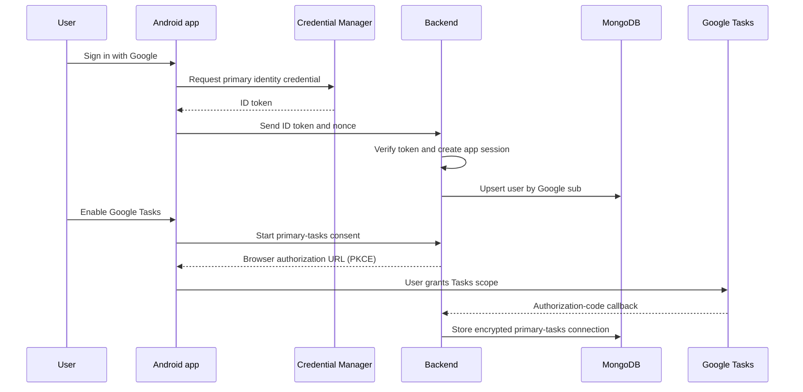
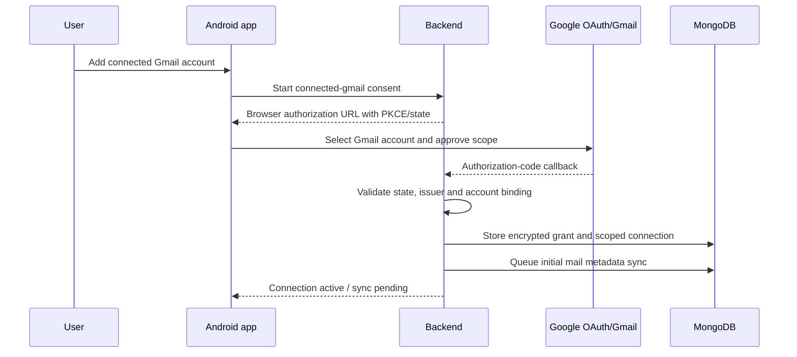
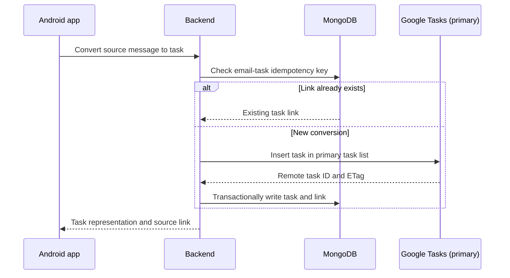

# Android Task Manager with Primary-Account SSO and Connected Gmail Accounts

## Executive summary

Build an Android task-management application in which one **primary Google account** is the user's app identity and the sole owner of the user's Google Tasks workspace. The user signs in once to the app with this account. The app then lets the user explicitly connect one or more additional Gmail accounts as managed mail sources.

The primary account is not a technical bypass for those other Gmail accounts. Every connected Gmail account has its own OAuth consent, its own revocable authorization, and its own least-privilege token. The app can read only the mail data that the user approved for that particular account. Email-derived tasks, reminders, preferences, account relationships, audit events, and sync state live in MongoDB; task-list and task records remain synchronized with Google Tasks under the primary account.

The recommended architecture is **Android client + backend + MongoDB**, with an optional event layer for Gmail mailbox changes. This is a deliberate change from the earlier client-first proposal: a backend is needed to centrally protect connected-account credentials, operate Gmail watches, retain normalized state, enforce the single primary-task-account rule, and provide a consistent experience across devices.

## Product model

### Account roles

| Role | Purpose | Google access | Data ownership |
| --- | --- | --- | --- |
| Primary account | Signs into the app, owns the user profile and the Google Tasks workspace. | OpenID Connect identity; Google Tasks read/write. Gmail is optional and must be consented separately. | Owns the MongoDB user document and every connected-account relationship. |
| Connected Gmail account | Supplies important/unread email metadata that can be reviewed and converted into tasks. | Gmail metadata or readonly scope, depending on the approved feature set. | Belongs to one primary user; it does not own the task workspace. |
| App backend | Enforces account ownership, runs sync, stores app-only data, and schedules watches/notifications. | Uses encrypted per-account OAuth grants; never obtains access without consent. | Stores only app-required metadata and encrypted credentials. |

### Core user journey

1. The user signs in with a Google account using Credential Manager. This becomes the primary account and app profile.
2. The user grants the primary account the Google Tasks scope when task management is enabled.
3. From **Connected inboxes**, the user chooses **Add Gmail account**. Google shows a separate account chooser and consent screen for that Gmail account.
4. The backend verifies that the new grant belongs to the current primary user, stores it encrypted, and starts a per-account mail sync.
5. Important or unread email cards are shown with a source-account badge. The user can convert a card into a task.
6. The created task is written to the primary account's selected Google Task list and linked to the source email in MongoDB.

The primary account can remove a connected inbox at any time. Removal revokes or invalidates the stored grant where supported, stops watches, and deletes the selected local/email metadata. It does not delete Google Tasks already created unless the user explicitly selects that option.

## Product requirements

### User stories

- As a user, I sign in once with my primary Google account and see the same workspace on any signed-in device.
- As a user, I connect multiple Gmail accounts, each with explicit consent, and can pause, reconnect, or remove each one independently.
- As a user, I manage all task lists and tasks in my primary Google Tasks account.
- As a user, I see important or unread emails from connected inboxes, clearly labelled by source account, and convert an email into a task in one action.
- As a user, I can use the task workspace offline; pending task operations are queued and synchronized safely when online.
- As a user, I receive due-date reminders for tasks and optional notifications when newly eligible email is found.
- As an administrator, I can audit sync health without storing unnecessary email content or exposing OAuth credentials.

### Functional requirements

#### Identity and SSO

- Use Android Credential Manager with Sign in with Google for the primary sign-in experience.
- Send an ID token to the backend over TLS; the backend validates issuer, audience, signature, expiration, and nonce before creating an app session.
- Create a stable internal `userId`; store Google's immutable `sub` as the primary external identity key. Email is display data, never the ownership key.
- Issue short-lived application access tokens and rotating refresh/session tokens. Do not use a Google access token as the app session.
- Support an explicit primary-account switch only through a deliberate migration flow; never silently reassign existing connected inboxes or tasks.

#### Connected Gmail accounts

- Use a separate OAuth authorization-code flow with PKCE for each connected Gmail account. Open the system browser/custom tab, never an embedded WebView.
- Request scope incrementally: prefer `gmail.metadata` when subject/snippet/body are not required; request `gmail.readonly` only when the approved experience needs message content. The exact scope must be shown before consent.
- Record `googleSubject`, display email, grant status, granted scopes, token expiry, last sync state, and user-selected inclusion settings for each connected account.
- Prevent attaching an account already linked to a different primary user unless an explicit transfer policy is implemented and verified.
- Treat Gmail data as account-scoped throughout the API, database, queues, logs, and UI.

#### Primary Google Tasks workspace

- Store one `primaryTaskConnection` per user. It may only reference the primary account identity.
- Let the user select a default Google Task list from that primary account; retain its Google task-list ID.
- Create, update, complete, restore, and delete Google Tasks through the primary account grant. Local task state mirrors Google Tasks and maintains remote IDs and ETags.
- Convert email to a task idempotently. The idempotency key is `(userId, sourceAccountId, gmailMessageId, destinationTaskListId)`; retries must return the original linked task rather than create a duplicate.
- Store app-only attributes in MongoDB, such as source-email link, internal tags, reminder preferences, sync state, notification history, and audit records. Do not assume Google Tasks can represent every custom field.

#### Sync, offline operation, and notifications

- Android uses Room as its encrypted/offline cache and WorkManager for constrained retries, local outbox delivery, and due-date notification scheduling.
- The backend is the authority for cross-device state, connected-account sync, token refresh, Gmail history cursor management, and Google Tasks reconciliation.
- Use a transactional outbox in MongoDB for server-side actions. A worker processes the outbox with idempotency keys and exponential backoff with jitter.
- For Gmail, begin with server-managed incremental synchronization using `historyId`; use Gmail watch plus Cloud Pub/Sub only after the backend operational path is ready. Watches must be renewed before expiry and must fall back to scheduled reconciliation.
- Use local Android notifications for due tasks. FCM is optional for server-detected inbox changes; notifications contain no email body or sensitive details on the lock screen by default.

### Non-functional requirements

| Area | Requirement |
| --- | --- |
| Reliability | At-least-once processing plus idempotency; no duplicate email-to-task conversions; visible per-account sync status and recovery action. |
| Performance | Fast local reads; background-only network work; paginate Gmail and Google Tasks requests; no full-mailbox scans in the UI path. |
| Security | TLS, verified ID tokens, encrypted OAuth credentials, key rotation, least-privilege scopes, audit trails, and no OAuth flow in a WebView. |
| Privacy | Store minimum email metadata; avoid bodies/attachments by default; independent revoke/delete for every connected account; publish a retention policy. |
| Availability | Graceful offline task editing; queued writes; degraded mail display when a connection is unavailable. |
| Accessibility | Compose/Material UI, semantic labels, scalable text, keyboard navigation, sufficient contrast, and notification-channel controls. |

## Recommended architecture



### Services

| Component | Responsibility |
| --- | --- |
| Android app | UI, primary sign-in initiation, connected-account consent initiation, Room cache, offline outbox, and local notifications. |
| Auth/API service | Validates identity, issues app sessions, enforces primary-user ownership, exposes user-scoped APIs, and creates OAuth connection requests. |
| Google integration service | Exchanges authorization codes, refreshes grants, calls Gmail and Google Tasks APIs, and normalizes remote records. |
| Sync worker | Processes MongoDB outbox jobs, Gmail history/watch events, Google Tasks reconciliation, retry/backoff, and dead-letter handling. |
| MongoDB | User profile, account relationships, encrypted-token references/ciphertext, normalized email metadata, task mirror, links, preferences, and audit history. |
| KMS/secret service | Envelope-encrypts OAuth refresh tokens and keeps encryption keys outside ordinary database reads. |

## MongoDB data model

MongoDB holds app state, not a shadow archive of mailbox content. All records are scoped by `userId`; source-account data must never be queried without both `userId` and `sourceAccountId`.

### `users`

```json
{
  "_id": "usr_...",
  "primaryGoogleSubject": "google-oidc-sub",
  "primaryEmail": "owner@example.com",
  "displayName": "Owner",
  "primaryTaskConnectionId": "conn_tasks_...",
  "defaultTaskListId": "google-task-list-id",
  "createdAt": "2026-10-04T00:00:00Z",
  "updatedAt": "2026-10-04T00:00:00Z"
}
```

Indexes: unique `primaryGoogleSubject`; unique sparse `primaryEmail` only if product policy requires it.

### `oauth_connections`

```json
{
  "_id": "conn_gmail_...",
  "userId": "usr_...",
  "provider": "google",
  "connectionType": "primary_tasks | connected_gmail",
  "googleSubject": "provider-subject",
  "email": "inbox@example.com",
  "scopes": ["https://www.googleapis.com/auth/gmail.metadata"],
  "credentialRef": "kms-encrypted-secret-reference",
  "status": "active | needs_reauth | paused | revoked | removed",
  "lastSuccessfulSyncAt": "2026-10-04T00:00:00Z",
  "createdAt": "2026-10-04T00:00:00Z"
}
```

Indexes: unique `{ userId, connectionType }` where `connectionType = primary_tasks`; unique `{ userId, googleSubject, connectionType }`; policy-controlled unique `googleSubject` for connected accounts if cross-user sharing is prohibited.

### `tasks`

```json
{
  "_id": "task_...",
  "userId": "usr_...",
  "googleTaskId": "remote-task-id",
  "googleTaskListId": "remote-list-id",
  "title": "Reply to vendor",
  "notes": "",
  "dueAt": "2026-10-05T09:00:00Z",
  "status": "needsAction | completed",
  "googleEtag": "etag",
  "source": { "type": "gmail", "emailLinkId": "link_..." },
  "appTags": ["finance"],
  "reminder": { "enabled": true, "at": "2026-10-05T08:00:00Z" },
  "sync": { "state": "synced | pending | conflicted", "lastSyncedAt": "2026-10-04T00:00:00Z" }
}
```

Indexes: unique `{ userId, googleTaskId }`; `{ userId, dueAt, status }`; `{ userId, 'sync.state' }`.

### `email_messages` and `email_task_links`

`email_messages` stores only required metadata: `userId`, `sourceAccountId`, Gmail message/thread IDs, labels, sender display value, subject/snippet subject to selected scope, received time, importance classification, and sync timestamps. It excludes attachments and full bodies by default.

`email_task_links` stores `userId`, `sourceAccountId`, `gmailMessageId`, `taskId`, `destinationTaskListId`, `createdAt`, and an idempotency key. Add a unique index on the idempotency key.

### Operational collections

- `sync_cursors`: Gmail `historyId`, watch expiration, pagination and reconciliation metadata per connection.
- `outbox`: durable command records with type, payload reference, idempotency key, next-attempt time, and attempt count.
- `audit_events`: security-sensitive actions only: sign-in, connection add/remove, reauthorization, task creation from mail, sync failure category, and user-initiated deletion. Never log access or refresh tokens.
- `notification_deliveries`: deduplication and user preference enforcement.

## API design

Every endpoint requires an application session. The backend derives `userId` from the session; clients never supply an arbitrary user ID in a route or body.

| Method | Endpoint | Purpose |
| --- | --- | --- |
| `POST` | `/v1/auth/google/complete` | Verify primary-account ID token and establish app session. |
| `GET` | `/v1/me` | Read primary profile, task workspace, and connection summaries. |
| `POST` | `/v1/connections/google/start` | Start explicit OAuth consent for `primary_tasks` or `connected_gmail`. |
| `GET` | `/v1/connections` | List authorized accounts and health without credentials. |
| `PATCH` | `/v1/connections/{connectionId}` | Pause, resume, or update selected mailbox/list settings. |
| `DELETE` | `/v1/connections/{connectionId}` | Disconnect one Gmail account and start deletion/revocation workflow. |
| `GET` | `/v1/tasks` | List primary-workspace tasks. |
| `POST` | `/v1/tasks` | Create a task in the primary account's selected Google Task list. |
| `PATCH` | `/v1/tasks/{taskId}` | Update a task with optimistic concurrency / ETag. |
| `POST` | `/v1/email-messages/{messageId}/convert-to-task` | Idempotently create/link a primary-account task. |
| `POST` | `/v1/sync` | Request a user-scoped sync; return queued status rather than blocking. |

Authorization rules: a user can access only documents with their `userId`; a connected Gmail connection cannot be used for Google Tasks; only the `primary_tasks` connection can write Google Tasks; raw tokens never appear in API responses.

## Key flows

### Primary account sign-in and task setup



### Add a connected Gmail account



### Convert email to task



## Sync and conflict strategy

### Primary Google Tasks

- The backend writes task changes with the latest known ETag where applicable. The app sends a mutation ID, and the backend persists it before invoking Google.
- If a remote change wins, return a structured `409 conflict` containing the latest safe representation; the client presents refresh/retry rather than silently overwriting user work.
- Use `updatedMin` for bounded reconciliation, but periodically perform a paginated full consistency scan to recover from a missed cursor or worker failure.
- Deletion is a durable operation: mark locally pending, execute remotely, then finalize once the remote result is confirmed. Never retry task creation without the idempotency link/check.

### Connected Gmail accounts

- Each inbox has a separate cursor and sync lock. Fetch only approved label/query data and minimal message fields.
- Gmail watch events are hints, not the data payload. The worker reads the appropriate mailbox history after receiving an event, handles history expiration/invalidity by a bounded rescan, and records a new cursor only after successful processing.
- If a Gmail authorization expires or is revoked, mark only that connection `needs_reauth`; the primary task workspace and other inboxes remain available.

### Offline Android behavior

- Room displays cached task and email-card data, with freshness and connection status visible to the user.
- Local task mutations are put in a client outbox with a UUID. WorkManager uploads them when network constraints are met; server-side idempotency makes retries safe.
- Conversion of an offline email card is queued; the final task ID is shown only after server confirmation. Never fabricate a Google Task ID locally.

## Security, privacy, and compliance

- Use OAuth 2.0 authorization code + PKCE for account connections and Credential Manager for Android primary sign-in. Do not place an OAuth client secret in the Android application and do not use embedded WebViews for Google consent.
- Store refresh tokens encrypted using envelope encryption (KMS-managed key encryption key, per-record data encryption key). Restrict decryption to the integration worker identity and record every privileged credential operation.
- Separate primary identity, primary Tasks authorization, and each Gmail authorization. A token for one connection is never reused for another API/account.
- Request `tasks` only when task mutation is enabled. Request Gmail scope only when the user adds an inbox, and expose the precise purpose and data-retention choice before consent.
- Keep task data and mail metadata logically separated by `userId` and `sourceAccountId`; use row/document-level authorization in every repository query.
- Do not persist mail bodies, attachments, or raw MIME by default. Redact email subjects/snippets from crash reports, analytics, logs, push notifications, and audit entries.
- Provide connection-specific revoke/remove, account-wide export/delete, retention controls, privacy policy, OAuth consent-screen disclosures, and the Google verification work required for production-sensitive scopes.

### Production OAuth configuration

Create the backend OAuth client as a Google Cloud **Web application** client and register this exact authorized redirect URI:

`https://ops.mohitrajsinh.me/api/auth/google/callback`

For local development, also register `http://localhost:3000/api/auth/google/callback` and set the matching value in the local `.env.local`. The redirect URI in Google Cloud Console must exactly match `GOOGLE_OAUTH_REDIRECT_URI`; use the production value for the deployed environment.

## Android stack

| Area | Choice |
| --- | --- |
| Language/UI | Kotlin, Jetpack Compose, Material 3 |
| Authentication | Credential Manager + Sign in with Google for primary identity; browser/custom-tab OAuth with PKCE for delegated connections |
| Architecture | MVVM or MVI, repository layer, Hilt dependency injection |
| Local storage | Room; SQLCipher/encrypted storage if threat model requires at-rest app-data encryption |
| Networking | Retrofit/OkHttp, Kotlin coroutines/Flow |
| Background work | WorkManager for local outbox, cache refresh, and reminders; backend workers for provider integration |
| Notifications | NotificationCompat and user-controlled channels; FCM only for server-originated events |
| Observability | Crashlytics or equivalent with PII redaction; OpenTelemetry/structured server logs; per-connection sync metrics |

## Delivery plan

### Phase 1 — foundation (weeks 1–3)

- Confirm data-retention and Google-scope decisions.
- Create Cloud project, OAuth consent configuration, Android and backend clients, MongoDB environment, KMS, and CI secrets handling.
- Implement Credential Manager primary sign-in, token verification, app sessions, user profile, and primary-task connection state.

### Phase 2 — primary task workspace (weeks 4–7)

- Implement Google Tasks synchronization for the primary account, MongoDB task mirror, Room cache, task CRUD, conflict handling, and due notifications.
- Add server/client outboxes, idempotency, retries, and basic sync health UI.

### Phase 3 — connected Gmail inboxes (weeks 8–11)

- Implement connection lifecycle, incremental Gmail sync, minimized email cards, account badges, and idempotent email-to-task conversion.
- Add remove/revoke, reauthorization, isolation tests, retention jobs, and audit events.

### Phase 4 — hardening and release (weeks 12–15)

- Add Gmail watch/Pub/Sub only if justified by product needs; otherwise retain scheduled incremental sync.
- Complete security review, OAuth verification preparation, privacy review, accessibility testing, device QA, load/retry tests, internal beta, and staged rollout.

## Test and acceptance plan

### Required tests

- Unit tests for ID-token validation boundaries, ownership checks, scope policy, token encryption interfaces, idempotency, task conflict handling, and Gmail cursor transitions.
- Integration tests using mocked Google APIs for primary-task-only enforcement, multi-Gmail isolation, expired/revoked grants, retries, duplicate callbacks, and failed network operations.
- End-to-end tests with separate Google test accounts: one primary account plus at least two connected Gmail accounts. Verify that tasks are created only in the primary account's task list.
- Android tests for offline task creation, app restart, notification permissions/channels, accessible account badges, and reauthentication recovery.
- Security tests for authorization bypass attempts: mutate another user's connection ID, reuse a Gmail connection as a Tasks grant, replay OAuth callback state, and request raw tokens.

### Release gates

1. No cross-user or cross-connection data access in automated authorization tests.
2. A task created from each connected inbox appears exactly once in the primary Google Tasks account.
3. Disconnecting one Gmail account stops its sync and leaves the other inboxes and primary tasks intact.
4. Offline mutation retries produce one remote task/update after reconnection.
5. Logs, notifications, and analytics contain no access tokens, refresh tokens, email body, or attachments.
6. OAuth consent, privacy policy, deletion flow, and production verification requirements are reviewed before public release.

## Decisions and boundaries

- This product does **not** grant the primary account automatic access to other Gmail accounts. Each connected Gmail account is a separately consented delegation.
- Google Tasks are centralized in the primary account by design. Connected Gmail accounts are email sources, not alternate task owners.
- MongoDB is the system of record for app-specific metadata and operational state; Google Tasks remains the source of truth for the actual Google task object.
- Start with required mail metadata and user-driven conversion. Automated AI classification, message-body storage, collaboration, and task sharing are out of scope until a separate privacy, scope, and product review approves them.

## Authoritative implementation references

- [Android Credential Manager](https://developers.google.com/identity/android-credential-manager) and [Sign in with Google best practices](https://developers.google.com/identity/siwg/best-practices) support the recommended Android identity path and prohibit embedded-WebView sign-in.
- [Google OAuth authorization guidance](https://developers.google.com/identity/authorization) and [OAuth scope reference](https://developers.google.com/identity/protocols/oauth2/scopes) underpin separate, least-privilege authorizations.
- [Google Tasks API](https://developers.google.com/workspace/tasks/reference/rest) and [tasks.list](https://developers.google.com/workspace/tasks/reference/rest/v1/tasks/list) define the task/list operations and incremental `updatedMin` reconciliation option.
- [Gmail push notifications](https://developers.google.com/workspace/gmail/api/guides/push) explains that watches notify a backend through Cloud Pub/Sub, must be renewed, and that polling/synchronize-client patterns remain recommended for user-owned devices.
